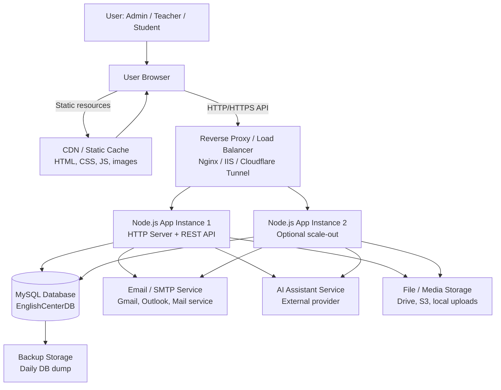
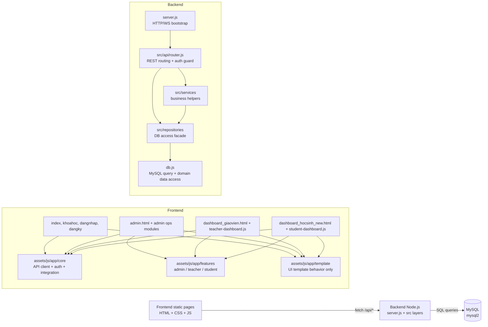
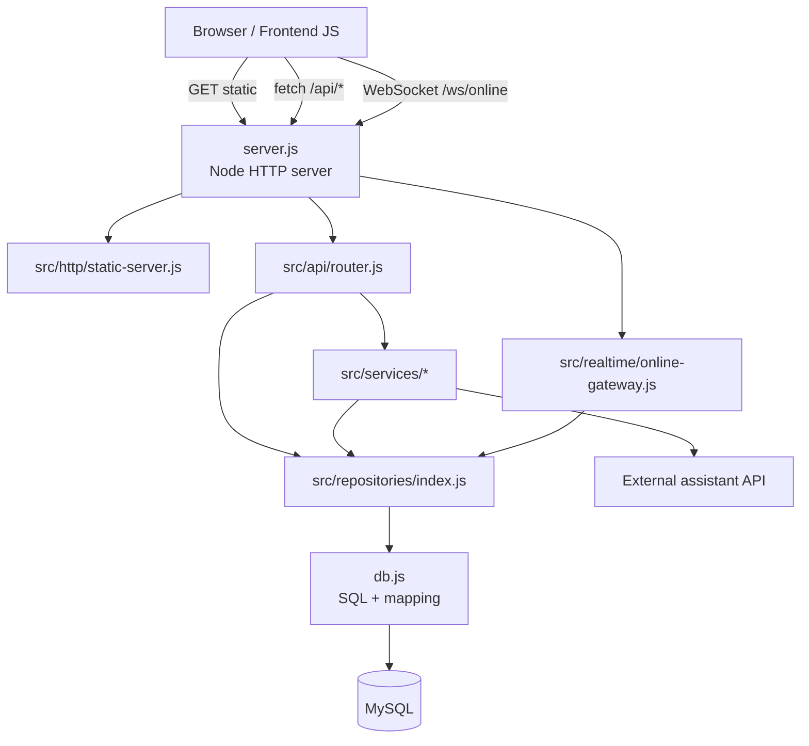
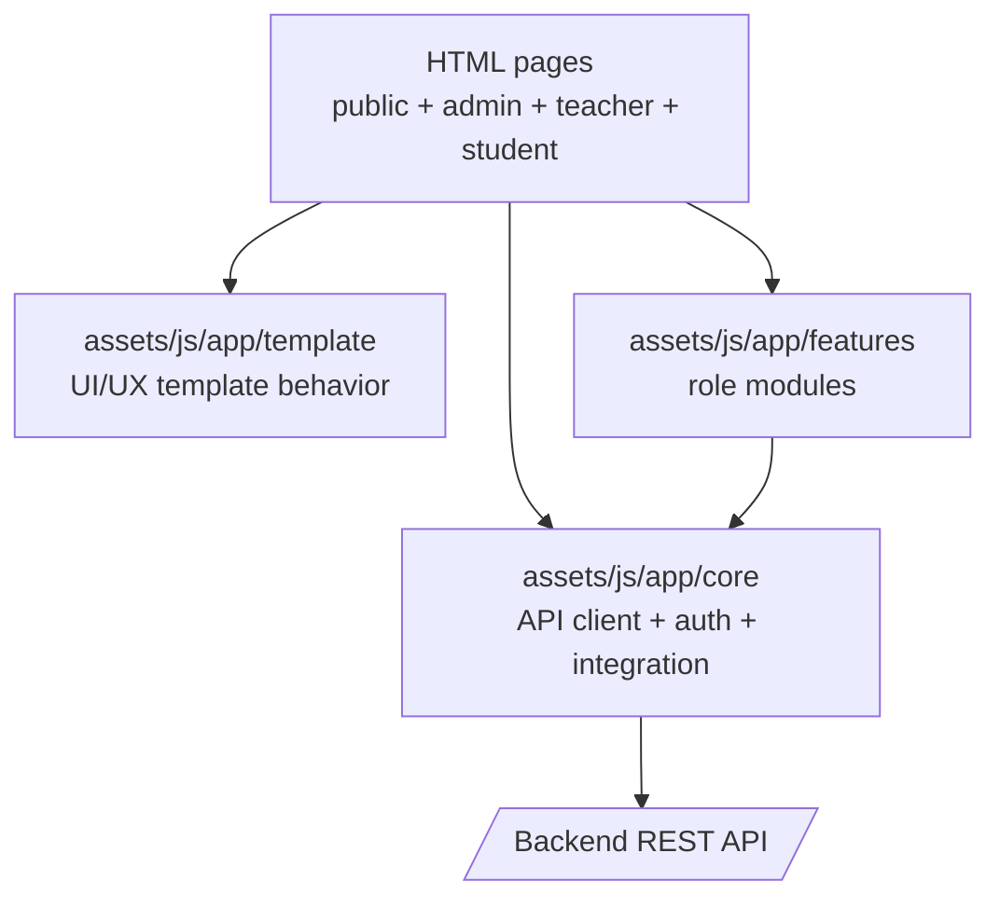
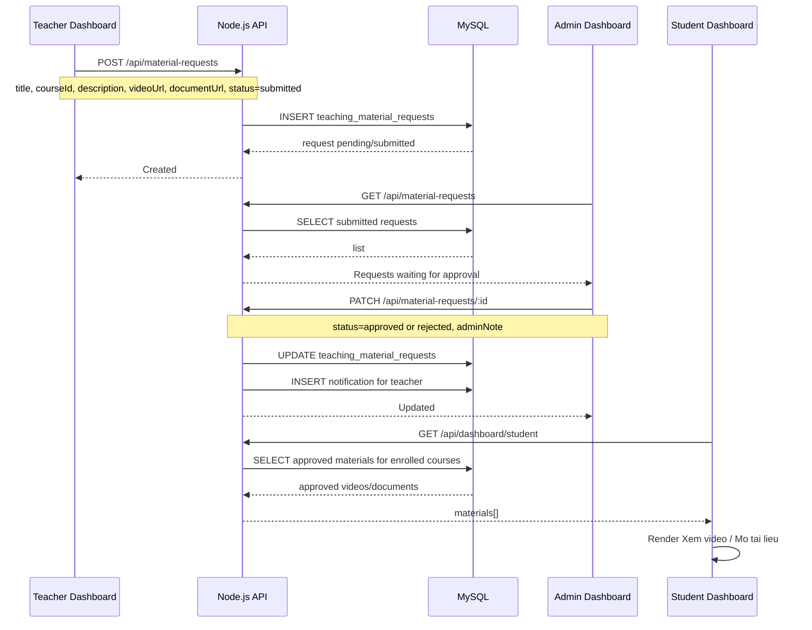
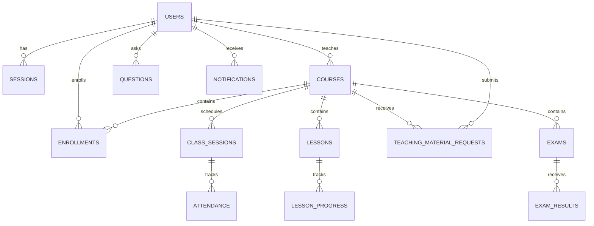
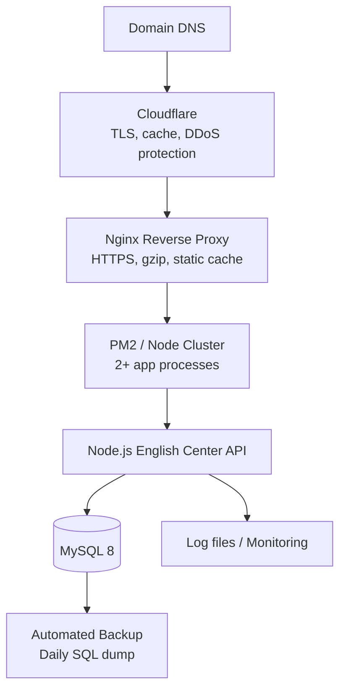

# English Center - System Architecture

Tai lieu nay mo ta kien truc he thong cua web English Center theo huong product, dua tren code hien tai va mo rong de trien khai production.

## 1. Tong quan kien truc

## 2. Kien truc hien tai trong source code

## 3. Thanh phan chinh

| Layer | Thanh phan | Vai tro |
| --- | --- | --- |
| Client | Browser | Nguoi dung truy cap web, dashboard, form dang nhap/dang ky |
| Static frontend | `frontend/*.html`, `frontend/assets/js/*.js` | Giao dien public, admin, giao vien, hoc sinh |
| Frontend core | `frontend/assets/js/app/core/*` | API client, auth/session, API-only guards, site integration |
| Frontend features | `frontend/assets/js/app/features/*` | Logic rieng theo role admin/giao vien/hoc sinh |
| Frontend template | `frontend/assets/js/app/template/*` | Hanh vi UI/UX cua template, khong chua data demo |
| Web server | `backend/server.js` | Entry point mong: nhan HTTP/WS, dieu huong sang static/API/realtime |
| API routing | `backend/src/api/router.js` | REST API, phan quyen, validate request va goi service/repository |
| HTTP/static | `backend/src/http/*` | Parse body, JSON response, serve static frontend |
| Services | `backend/src/services/*` | Xu ly nghiep vu dung chung: user/password, session, assistant service |
| Realtime | `backend/src/realtime/online-gateway.js` | WebSocket online presence cho admin |
| Repository facade | `backend/src/repositories/index.js` | Cong truy cap data layer cho API/service |
| Data access | `backend/db.js` | Query MySQL va mapping du lieu domain |
| Database | `backend/database.sql` | Schema users, courses, enrollments, lessons, exams, material requests |
| Migration | `backend/migrate-db.js` | Cap nhat DB cu khi them cot/bang moi |
| Seed/setup | `setup-db.js`, `seed.js` | Tao DB va du lieu khoi tao |

## 3.1. Backend layered architecture

Quy uoc khi them chuc nang moi:

1. `server.js` chi bootstrap, khong viet logic nghiep vu moi tai day.
2. Endpoint moi dat trong `src/api/router.js` hoac tach controller rieng neu module lon.
3. Logic dung chung dat trong `src/services`.
4. Moi truy van database di qua `src/repositories` va `db.js`.
5. Frontend chi goi `/api/*`, khong render bang demo khi API chua tra ve du lieu.

## 3.2. Frontend layered architecture

Quy uoc frontend:

1. `template/` chi dieu khien UI/UX giong mau: sidebar, collapse, animation, chart helper.
2. `core/api-client.js` la cua ngo duy nhat de goi `/api/*`.
3. `features/admin`, `features/teacher`, `features/student` chi render du lieu that tu API.
4. Template/demo cu khong duoc dashboard product load thi xoa, khong giu fallback demo trong product.

## 4. Role va phan quyen

```mermaid
flowchart TD
  Admin[Admin]
  Teacher[Teacher]
  Student[Student]

  Admin --> ManageUsers[Quan ly giao vien, hoc sinh, admin]
  Admin --> ManageCourses[Quan ly khoa hoc, lop hoc]
  Admin --> ApproveContent[Duyet bai giang, tai lieu, de thi]
  Admin --> Finance[Theo doi hoc phi, doanh thu]

  Teacher --> ManageOwnClasses[Quan ly lop/khoa duoc phan cong]
  Teacher --> UploadLessons[Tao bai giang, video, tai lieu]
  Teacher --> Grade[Cham bai, tra loi cau hoi]
  Teacher --> Schedule[Len lich hoc, diem danh]

  Student --> Enroll[Dang ky khoa hoc]
  Student --> Study[Xem bai giang da duyet]
  Student --> Exam[Lam bai, xem ket qua]
  Student --> AskQuestion[Hoi dap giao vien]
```

## 5. Luong bai giang: Teacher upload -> Admin approve -> Student view

## 6. API groups

| API | Vai tro |
| --- | --- |
| `/api/auth/login`, `/api/auth/register`, `/api/auth/me`, `/api/auth/logout` | Dang nhap, dang ky, session |
| `/api/users` | Quan ly hoc sinh/giao vien/admin |
| `/api/courses` | Quan ly khoa hoc/lop hoc |
| `/api/enrollments` | Ghi danh hoc sinh vao khoa hoc |
| `/api/class-sessions` | Lich hoc, phong hoc, diem danh |
| `/api/material-requests` | Teacher gui bai giang/tai lieu, admin duyet, student xem noi dung approved |
| `/api/exams`, `/api/exam-results` | De thi, bai nop, cham diem |
| `/api/questions` | Hoi dap hoc sinh - giao vien |
| `/api/notifications` | Thong bao trong dashboard |
| `/api/chat` | Tro ly ao / AI service adapter |

## 7. Database core entities

## 8. Production deployment de xuat

### Production notes

- Dat sau Nginx/Cloudflare de co HTTPS, cache static, gzip va rate limit.
- Chay Node bang PM2 hoac Windows Service de app tu restart khi loi.
- Tach `.env` cho DB password, session secret, API keys.
- Backup MySQL hang ngay va giu it nhat 7 ban gan nhat.
- Neu upload file that, nen dung S3/Cloudinary/Google Drive thay vi luu truc tiep vao repo.
- Neu co AI assistant, backend chi nen giu adapter `/api/chat`; API key khong dua ra frontend.

## 9. Data flow theo chuc nang product

### Admin quan ly he thong

1. Admin dang nhap.
2. Dashboard goi `/api/dashboard/admin`, `/api/users`, `/api/courses`, `/api/enrollments`.
3. Admin tao/sua khoa hoc, gan giao vien, quan ly hoc sinh.
4. Admin duyet material request tu giao vien.

### Giao vien tao noi dung

1. Giao vien dang nhap vao dashboard.
2. He thong chi load khoa hoc/lop hoc cua giao vien do.
3. Giao vien tao bai giang, nhap link video/tai lieu, gui duyet.
4. Trang thai bai giang: `pending`, `submitted`, `approved`, `rejected`.

### Hoc sinh hoc bai

1. Hoc sinh dang ky/dang nhap.
2. Hoc sinh ghi danh vao khoa hoc.
3. Dashboard hoc sinh goi `/api/dashboard/student`.
4. API chi tra bai giang/tai lieu `approved` thuoc khoa hoc hoc sinh da ghi danh.
5. Hoc sinh xem video, mo tai lieu, lam de thi va xem tien do.

## 10. Huong nang cap tiep theo

- Them file upload that: multipart upload -> storage -> save URL vao `teaching_material_requests`.
- Them table `lesson_contents` neu muon bien material approved thanh lesson chinh thuc.
- Them audit log cho admin action: ai duyet, duyet luc nao, ly do tu choi.
- Them RBAC middleware ro hon cho tung API.
- Them health check `/api/health` cho load balancer.
- Them monitoring: request logs, slow query logs, error alert.
